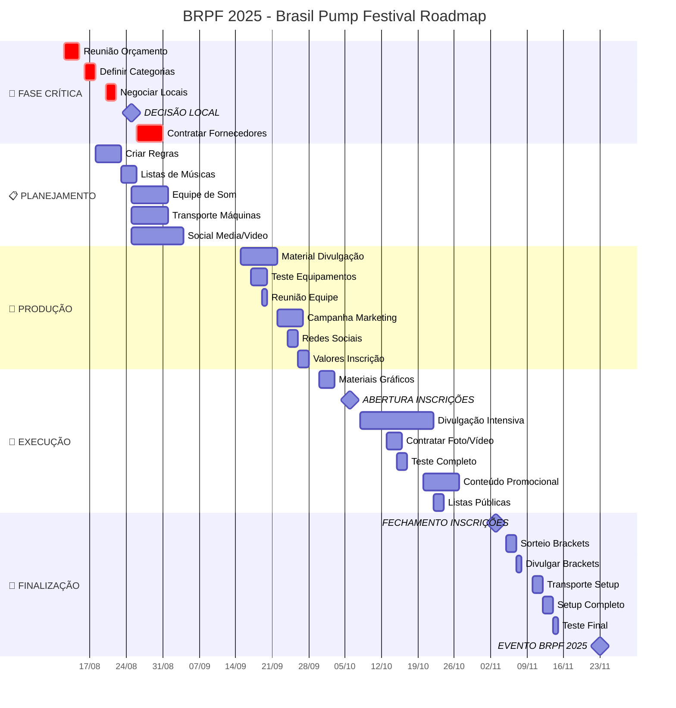
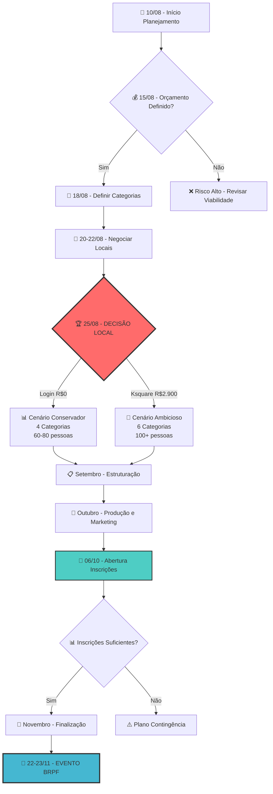
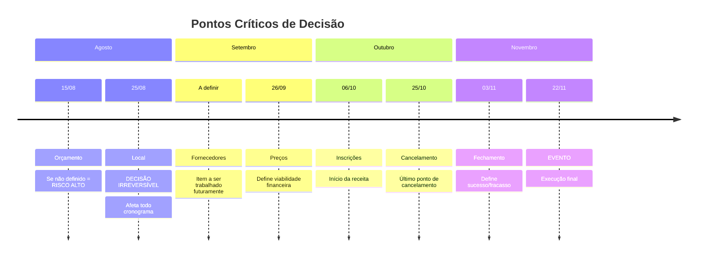
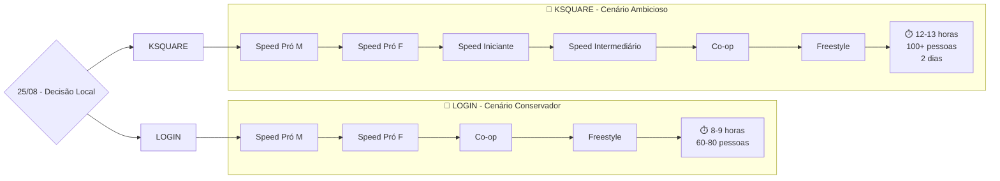
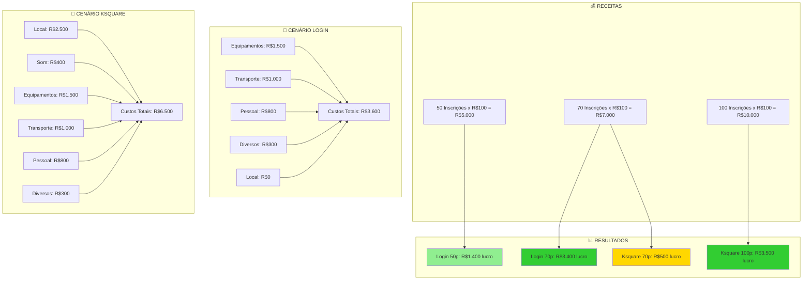
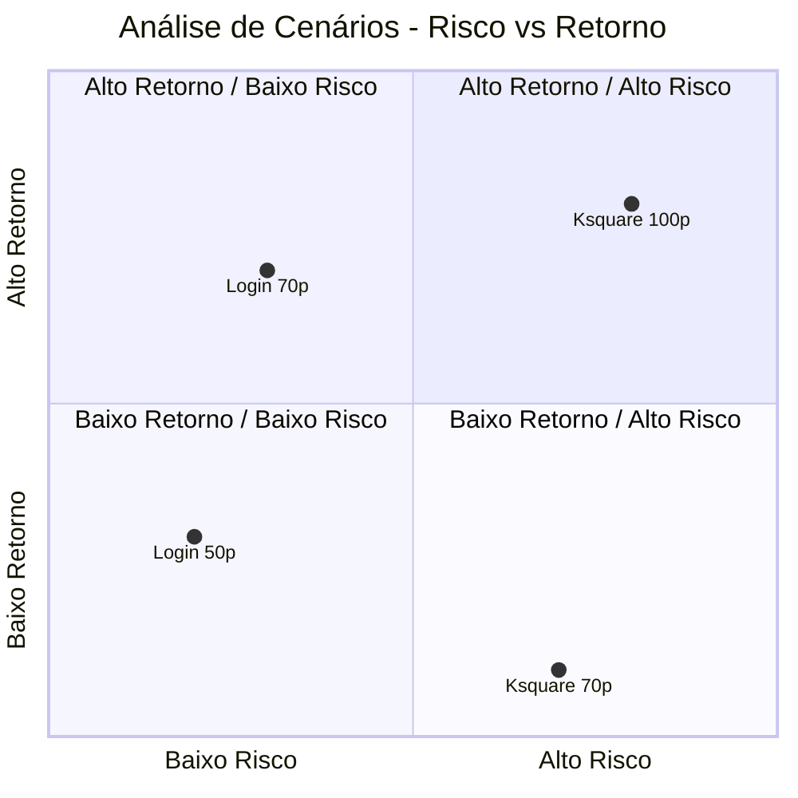
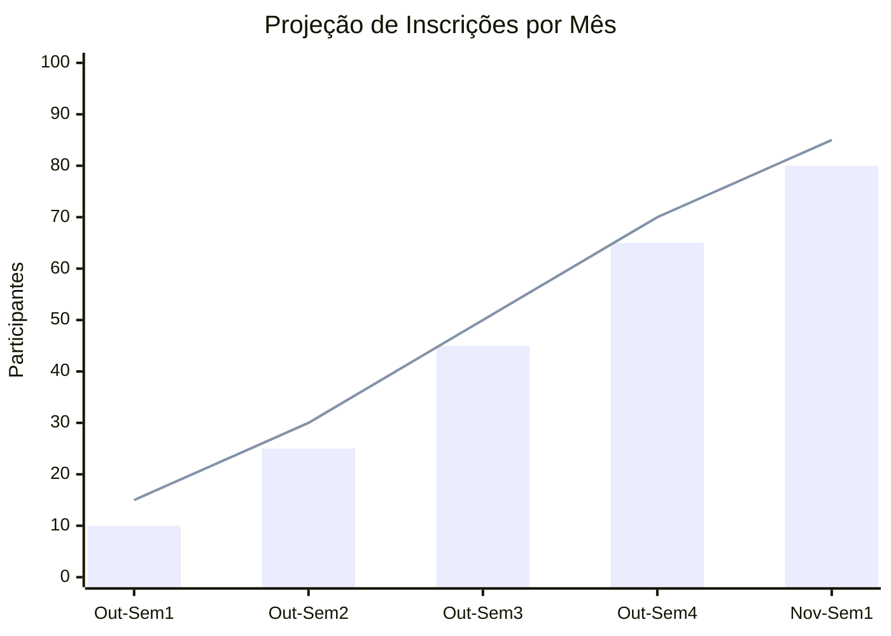
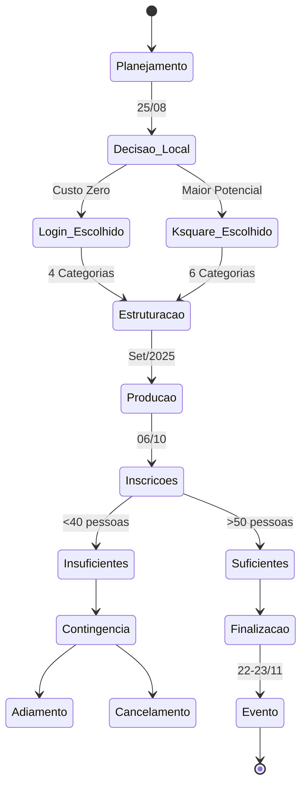

# Roadmap Visual - BRPF 2025

## 🗺️ Roadmap Interativo em Mermaid

## 🎯 Marcos Críticos e Dependências

## 📊 Timeline de Riscos e Contingências

## 🎮 Fluxo de Categorias por Local

## 💰 Análise Financeira Visual

## 🎯 Matriz de Risco vs Retorno

## 📈 Cronograma de Participantes

## 🔄 Estados do Projeto

---

## 🛠️ Como Usar Este Roadmap

### Visualização Online
1. Copie qualquer código Mermaid acima
2. Cole em [mermaid.live](https://mermaid.live)
3. Visualize e exporte como PNG/SVG

### Integração com Documentação
- Os diagramas são renderizados automaticamente no GitHub
- Compatível com GitLab, Notion, e outras plataformas
- Pode ser integrado em apresentações PowerPoint/Google Slides

### Atualizações Dinâmicas
- Modifique as datas conforme necessário
- Adicione novos marcos ou tarefas
- Ajuste as dependências conforme o projeto evolui

### Alternativas de Visualização
Se preferir outras ferramentas além do Mermaid:
- **Lucidchart**: Para diagramas mais elaborados
- **Draw.io**: Gratuito e integrado ao Google Drive
- **Microsoft Project**: Para cronogramas detalhados
- **Trello/Notion**: Para acompanhamento de tarefas

---

## 📅 NOTA SOBRE DATAS ALTERNATIVAS

**Data Preferencial:** 22-23 de novembro de 2025 (aproveitando feriado de 20/11)

**Datas Alternativas para Negociação:**
- **Plano B:** 29-30 de novembro ou 6-7 de dezembro
- **Plano C:** 15-16 de novembro ou 13-14 de dezembro

Todos os diagramas acima refletem o cronograma baseado na data preferencial. Caso seja necessário usar uma data alternativa, os marcos e prazos serão ajustados proporcionalmente.

---

*Roadmap criado em: 08 de dezembro de 2025*  
*Baseado no planejamento completo do BRPF 2025*  
*Atualizado com datas alternativas em: 08 de dezembro de 2025*
